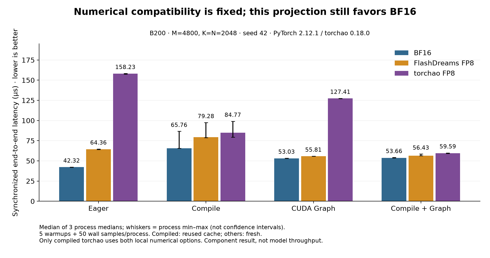
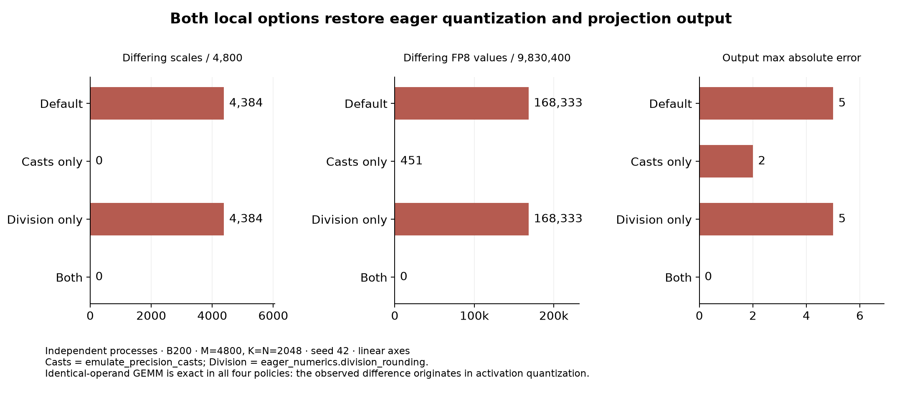

# Torchao output-projection evidence for NVIDIA/flashdreams#625

The corrected local compiler policy passes **54/54 component benchmark processes**.
It does **not** justify adopting torchao for this tested projection: BF16 remains
faster, and retaining checkpoint source weights increases resident weight storage.
No model generation or model-quality evaluation was performed.




## Data and methodology

- [Full English report](REPORT.md): scope, capability inventory, original failures,
  root cause, lifecycle checks, startup/memory/numerical metrics, limitations.
- [Current measurements JSON](data/current/measurements.json) and
  [CSV](data/current/measurements.csv): all 54 independent-process results,
  including cold and reused compiler caches. Nested fields remain in JSON.
- [Raw pytest-benchmark exports](data/current/raw): 50 synchronized wall samples
  per process, in **seconds** (`benchmarks[0].stats.data`); CUDA event samples in
  **milliseconds** (`extra_info.cuda_event_samples_ms`). No samples were removed.
- [Manifest](data/current/manifest.json): commands, base commit, source-diff hash,
  run labels, repeats and return codes. Experimental source is still local;
  the base commit alone does not contain the implementation.
- [Four-policy diagnosis](data/diagnosis): scales/FP8 mismatch counts, preserved
  input witnesses, identical-operand and crossed-quantization GEMM, global-state
  isolation. `both` restores exact numerical equality in the tested seed/shape.
- [Original measurements](data/original/measurements.json): default-policy failure
  evidence (42 pass, 12 parity failures), including the disclosed rerun of one
  native-FP8 eager process after a temporary-file failure. This earlier allocation
  is not a controlled estimate of the compiler options' performance cost.
- [Validation logs](validation): CPU, GPU, attention lifecycle, type checks and
  documentation build. See the report for exact scope; not whole-model validation.

Hardware/software: one allocated NVIDIA B200; Python 3.12.13,
PyTorch 2.12.1+cu130, torchao 0.18.0, Triton 3.7.1, CUDA 13.0,
cuDNN 92000, NVIDIA driver 580.126.20. Linear M=4800, K=N=2048,
BF16 input and source weights, no bias, seed 42; all backends share input/weights.
Three processes per backend/mode/cache cell, five warmup calls and 50 measured
wall calls plus a separate 50-sample CUDA event pass. Dynamic activation
quantization is timed. Capture startup includes first replay and output clone.

The latency chart uses median of three process medians; whiskers show their
min/max, **not a confidence interval**. Compiled rows use reused caches in new
processes; eager/graph rows use fresh caches. Only compiled torchao receives
`emulate_precision_casts=True` and `eager_numerics.division_rounding=True`.
Default behavior, global compiler settings and 0.02/0.02 parity tolerance are unchanged.

## Reproduce the figures

From this directory, in an isolated plotting environment:

```sh
python -m pip install matplotlib==3.11.2
python render_figures.py
sha256sum -c SHA256SUMS
```

The figure script validates sample counts, process grouping and summary medians
against the raw wall samples before plotting. It writes PNG and SVG figures.
Checksums describe the published files; regenerating with another environment
may change rendered bytes without changing measurements.

This public export removes local absolute paths, machine hostnames and detailed
CPU identifiers. Numeric observations are unchanged. `<REPO>`, `<HOME>`,
`<TMP>` and `<B200-node>` are redaction markers. Original evidence and compiler
caches remain local under `artifacts/torchao-625/`; report references to that
layout describe the original archive, not missing files in this public subset.
No checkpoints, model outputs, full caches, credentials or implementation patch
are published here. Generated charts and data accompany the repository's license.
